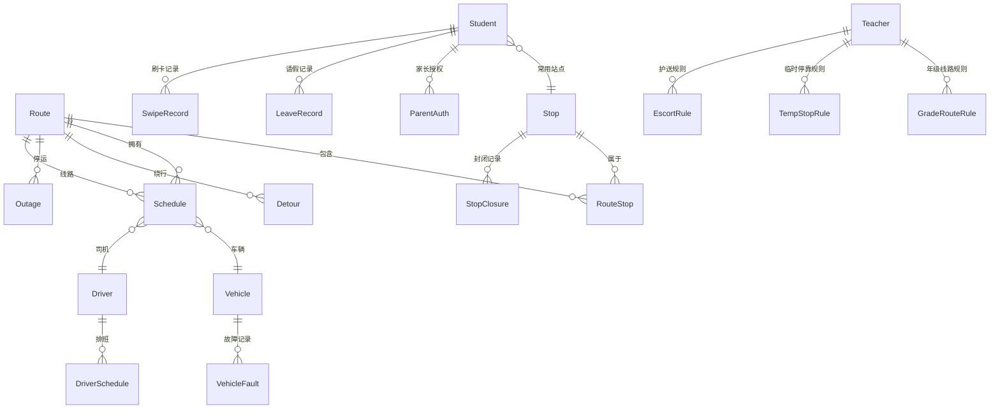

## 1. 架构设计

```mermaid
graph TB
    subgraph "前端层"
        "React App" --> "路由层 (React Router)"
        "路由层" --> "调度端页面"
        "路由层" --> "站点牌大屏页面"
        "路由层" --> "学生视图页面"
        "路由层" --> "老师配置页面"
        "路由层" --> "车辆状态页面"
        "路由层" --> "线路模拟器页面"
        "路由层" --> "应急调度页面"
        "路由层" --> "规则解释页面"
        "路由层" --> "历史回放页面"
    end

    subgraph "状态管理层"
        "Zustand Stores" --> "线路Store"
        "Zustand Stores" --> "站点Store"
        "Zustand Stores" --> "车辆Store"
        "Zustand Stores" --> "司机Store"
        "Zustand Stores" --> "班次Store"
        "Zustand Stores" --> "学生Store"
        "Zustand Stores" --> "老师Store"
        "Zustand Stores" --> "家长Store"
        "Zustand Stores" --> "请假Store"
        "Zustand Stores" --> "刷卡Store"
        "Zustand Stores" --> "天气Store"
        "Zustand Stores" --> "历史Store"
    end

    subgraph "规则引擎层"
        "规则引擎" --> "可乘线路推导"
        "规则引擎" --> "到站时间计算"
        "规则引擎" --> "满员判断"
        "规则引擎" --> "故障替换"
        "规则引擎" --> "绕行影响计算"
        "规则引擎" --> "天气延误计算"
        "规则引擎" --> "低年级限制"
    end

    subgraph "数据层"
        "本地Mock数据" --> "初始数据加载"
        "Zustand Persist" --> "LocalStorage持久化"
    end
end
```

## 2. 技术说明

- **前端框架**：React@18 + TypeScript + Vite
- **样式方案**：Tailwind CSS@3
- **状态管理**：Zustand（含persist中间件持久化到localStorage）
- **路由**：React Router DOM@6
- **图标**：Lucide React
- **后端**：无后端，纯前端本地数据驱动
- **数据持久化**：localStorage（Zustand persist中间件）
- **容器化**：Docker + Nginx静态部署

## 3. 路由定义

| 路由 | 用途 |
|------|------|
| `/` | 首页/角色选择入口 |
| `/dispatch` | 调度端主页 |
| `/dispatch/routes` | 线路管理 |
| `/dispatch/schedules` | 班次管理 |
| `/dispatch/drivers` | 司机排班 |
| `/dispatch/outages` | 停运管理 |
| `/dispatch/detours` | 绕行管理 |
| `/stop-board` | 站点牌大屏 |
| `/student` | 学生视图 |
| `/student/card` | 学生乘车卡 |
| `/teacher` | 老师配置 |
| `/teacher/rules` | 老师规则配置 |
| `/vehicle` | 车辆状态 |
| `/vehicle/drivers` | 司机车辆看板 |
| `/simulator` | 线路模拟器 |
| `/emergency` | 应急调度 |
| `/rules` | 规则解释面板 |
| `/history` | 历史回放 |

## 4. 数据模型

### 4.1 数据模型定义



### 4.2 核心类型定义

```typescript
interface Route {
  id: string;
  name: string;
  color: string;
  stops: RouteStop[];
  isActive: boolean;
}

interface RouteStop {
  routeId: string;
  stopId: string;
  order: number;
  estimatedMinutes: number;
}

interface Stop {
  id: string;
  name: string;
  location: string;
  capacity: number;
  isClosed: boolean;
}

interface Vehicle {
  id: string;
  plateNumber: string;
  capacity: number;
  currentLoad: number;
  status: 'normal' | 'full' | 'fault' | 'inspection_expired';
  replacementVehicleId?: string;
  inspectionExpiryDate: string;
}

interface Driver {
  id: string;
  name: string;
  licenseExpiryDate: string;
  phone: string;
}

interface Schedule {
  id: string;
  routeId: string;
  vehicleId: string;
  driverId: string;
  departureTime: string;
  isActive: boolean;
}

interface Student {
  id: string;
  name: string;
  grade: number;
  stopId: string;
  identity: 'day_student' | 'boarder';
  parentAuthorized: boolean;
}

interface ParentAuth {
  id: string;
  studentId: string;
  routeIds: string[];
  authorizedAt: string;
  expiresAt: string;
}

interface LeaveRecord {
  id: string;
  studentId: string;
  startDate: string;
  endDate: string;
  reason: string;
}

interface SwipeRecord {
  id: string;
  studentId: string;
  scheduleId: string;
  stopId: string;
  swipeTime: string;
  type: 'board' | 'alight';
}

interface Teacher {
  id: string;
  name: string;
  grades: number[];
}

interface GradeRouteRule {
  id: string;
  teacherId: string;
  grade: number;
  allowedRouteIds: string[];
}

interface TempStopRule {
  id: string;
  teacherId: string;
  scheduleId: string;
  stopId: string;
  duration: number;
  reason: string;
  effectiveDate: string;
}

interface EscortRule {
  id: string;
  teacherId: string;
  grade: number;
  requireEscort: boolean;
  escortStopIds: string[];
}

interface Detour {
  id: string;
  routeId: string;
  skippedStopIds: string[];
  alternativeStopIds: string[];
  startDate: string;
  endDate: string;
  reason: string;
}

interface Outage {
  id: string;
  routeId?: string;
  vehicleId?: string;
  startDate: string;
  endDate: string;
  reason: string;
}

interface StopClosure {
  id: string;
  stopId: string;
  startDate: string;
  endDate: string;
  reason: string;
  alternativeStopId?: string;
}

interface WeatherDelay {
  id: string;
  routeId: string;
  delayMinutes: number;
  reason: string;
  effectiveDate: string;
}

interface HistoryRecord {
  id: string;
  type: string;
  entityType: string;
  entityId: string;
  action: string;
  data: any;
  timestamp: string;
  operator: string;
}
```

## 5. 规则引擎设计

规则引擎是系统核心，所有展示结果均由规则引擎实时推导，不写死任何展示逻辑。

### 5.1 可乘线路推导规则链

```
输入: studentId
输出: AvailableRoute[]

推导链:
1. 获取学生信息(年级、站点、身份)
2. 检查家长授权 → 未授权则标记原因
3. 检查请假状态 → 请假中则返回空列表
4. 获取经停学生站点的所有线路
5. 应用年级限制规则 → 低年级仅显示指定线路
6. 排除停运线路 → 标记停运原因
7. 排除封闭站点 → 标记封闭原因+换乘建议
8. 排除满员车辆 → 标记满员原因
9. 应用绕行规则 → 更新到站时间
10. 应用临时停靠 → 更新到站时间
11. 应用天气延误 → 更新到站时间
12. 检查车辆年检和驾驶证 → 标记异常
13. 输出结果 + 推导解释
```

### 5.2 到站时间计算规则

```
基础时间 = 发车时间
+ 站点间行驶时间(从RouteStop.estimatedMinutes累加)
+ 临时停靠时间(TempStopRule.duration)
+ 天气延误时间(WeatherDelay.delayMinutes)
- 绕行跳过站点(减去对应行驶时间)
```

### 5.3 故障替换规则

```
当车辆标记为fault:
1. 查找同线路所有状态为normal的车辆
2. 按容量优先排序
3. 自动分配替换车辆
4. 更新Schedule.vehicleId
5. 记录HistoryRecord
6. 如无可用车辆 → 标记对应班次停运
```

## 6. 项目目录结构

```
src/
├── components/          # 通用组件
│   ├── Layout/          # 布局组件
│   ├── StatusBadge/     # 状态标签
│   └── RouteColorBar/   # 线路颜色条
├── pages/               # 页面组件
│   ├── Home/            # 首页
│   ├── Dispatch/        # 调度端
│   ├── StopBoard/       # 站点牌大屏
│   ├── Student/         # 学生视图
│   ├── Teacher/         # 老师配置
│   ├── Vehicle/         # 车辆状态
│   ├── Simulator/       # 线路模拟器
│   ├── Emergency/       # 应急调度
│   ├── Rules/           # 规则解释
│   └── History/         # 历史回放
├── stores/              # Zustand状态管理
│   ├── routeStore.ts
│   ├── stopStore.ts
│   ├── vehicleStore.ts
│   ├── driverStore.ts
│   ├── scheduleStore.ts
│   ├── studentStore.ts
│   ├── teacherStore.ts
│   ├── parentStore.ts
│   ├── leaveStore.ts
│   ├── swipeStore.ts
│   ├── weatherStore.ts
│   └── historyStore.ts
├── engine/              # 规则引擎
│   ├── availabilityEngine.ts    # 可乘线路推导
│   ├── arrivalEngine.ts         # 到站时间计算
│   ├── replacementEngine.ts     # 故障替换引擎
│   └── ruleExplainer.ts         # 规则解释生成
├── data/                # 初始Mock数据
│   └── initialData.ts
├── types/               # TypeScript类型定义
│   └── index.ts
├── utils/               # 工具函数
├── App.tsx
└── main.tsx
```
